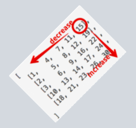

### 0240. Search a 2D Matrix II

>Time Complexity : $O(N)$ \
>Space Complexity : $O(1)$

**Description**

#### Try 1 (Fail)
- target에 가장 가까운 첫 원소를 가진 행(혹은 열)을 찾는 다고 해서 해당 행(혹은 열)에 target이 있다는 보장을 할 수가 없다!
- $O(log_{2}m*log_{2}n)$ 실패
```cpp
class Solution1 {
public:
    bool searchMatrix(vector<vector<int>>& matrix, int target) {
        int m = matrix.size();
        int n = matrix[0].size();

        // Find the row
        int low(0), high(m), mid;
        while(low < high)
        {
            mid = (low+high)/2;
            if(matrix[mid][0] < target)
                low = mid + 1;
            else if(target < matrix[mid][0])
                high = mid;
            else
                return true; 
        }

        int row = high-1;
        cout << "row: " << row << endl;
        low = 0, high = n;
        while(low < high)
        {
            mid = (low+high)/2;
            if(matrix[row][mid] < target)
                low = mid + 1;
            else if(target < matrix[row][mid])
                high = mid;
            else
                return true;
        }

        if(high < n && matrix[row][high] == target)
            return true;
        else
            return false;
    }
};
```

#### Try 2 (Success)
- 그렇다면 차선책으로 m과 n 중 작은 쪽을 택해 각 행마다 Binary Search를 수행한다.

>**Runtime: 120 ms, faster than 79.27%** of C++ online submissions for Search a 2D Matrix II. \
>**Memory Usage: 14.6 MB, less than 95.02%** of C++ online submissions for Search a 2D Matrix II.
```cpp
class Solution {
public:
    bool searchMatrix(vector<vector<int>>& matrix, int target) {
        int m = matrix.size();
        int n = matrix[0].size();
        bool ans(false);

        for(int i=0; i<m; i++)
        {
            auto &arr = matrix[i];
            ans |= searchRow(arr, target);
            if(ans)
                return true;
        }
        return false;
    }

    bool searchRow(const vector<int>& arr, int t)
    {
        if(t < arr.front() || arr.back() < t)
            return false;
        
        int l(0), r(arr.size()-1);
        while(l < r)
        {
            int m = (l+r)/2;
            if(t < arr[m])
                r = m - 1;
            else if(arr[m] < t)
                l = m + 1;
            else
                return true;
        }
        return (t == arr[l]);
    }
};
```

#### Try 3(Ref)
- $log(m+n)$ **Method**
- Greedy한 풀이로, Right-most 원소부터 시작하여
  - Target보다 크면 열을 감소시키고, 
  - 작으면 행을 증가시킨다.
- If anyone wonders why it looks like a tree, this image may help you. \


**Intuition behind the problem:**

1. It is given that rows and columns are sorted. So the optimal way should involved binary search / complexity can be optimized to logarithmic.
2. In any search problem, **The Basic Motive** is *to reduce the decision space progressively*. The more aggressively the search space is reduced, the more efficient the algorithm.
    - To reduce decision space means to eliminate certain portion completely from search in future. Here, due to the property of rows & columns being sorted, we can verify that we can utilise the given properties to reduce search space only if we begin at bottom left corner or top right corner. This is because at only those two starting positions, we would be able to exercise decisions to reduce our decision/search space in both directions i.e.
    - i. if we start at bottom left corner => we can go right to get elements in increasing order & top to get elements in decreasing order.
    - ii. if we start at top right corner => we can go left to get elements in decreasing order & bottom to get elements in increasing order.
    - We can't have both choices if we start at top left or bottom right indices.
  
```cpp
class Solution {
public:
    bool searchMatrix(vector<vector<int>>& matrix, int target) {
        int m = matrix.size();
        if(!m) return false;
        int n = matrix[0].size();

        int row(0), col(n-1);
        while(row < m && 0 <= col)
        {
            int e = matrix[row][col];
            if(e < target)
                row++;
            else if(e > target)
                col--;
            else // if(e == target)
                return true;
        }
        return false;
    }
};
```